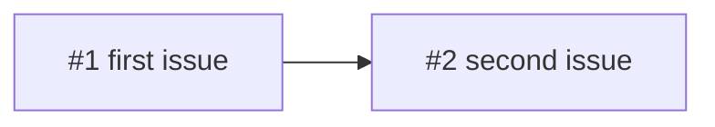

## Description

<!-- The goal in one paragraph, why now, and the decision record behind it (ADR). End with the sentence that also closes the milestone: "Done when …". -->

**Can start now:** <!-- the issues with no open dependency -->

**Out of scope:** <!-- what this epic leaves for later, and where it is tracked -->

### Phase 1 · <!-- name -->

- [ ] #

### Phase 2 · <!-- name -->

- [ ] #

### Dependencies

### Progress

Nothing yet.
